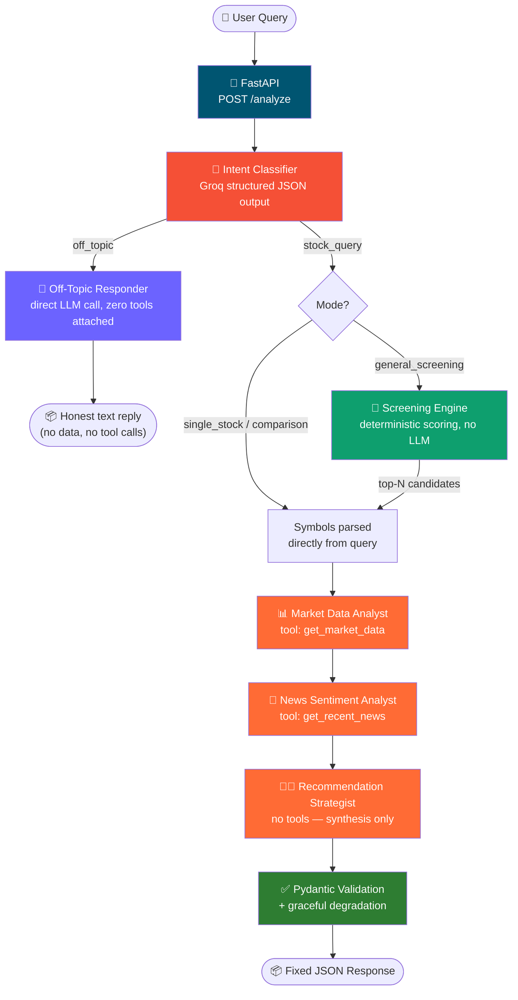
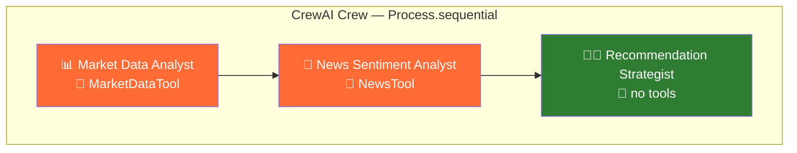
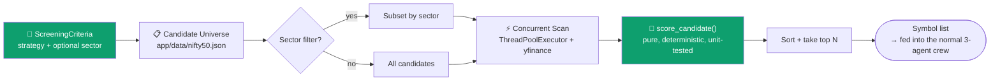
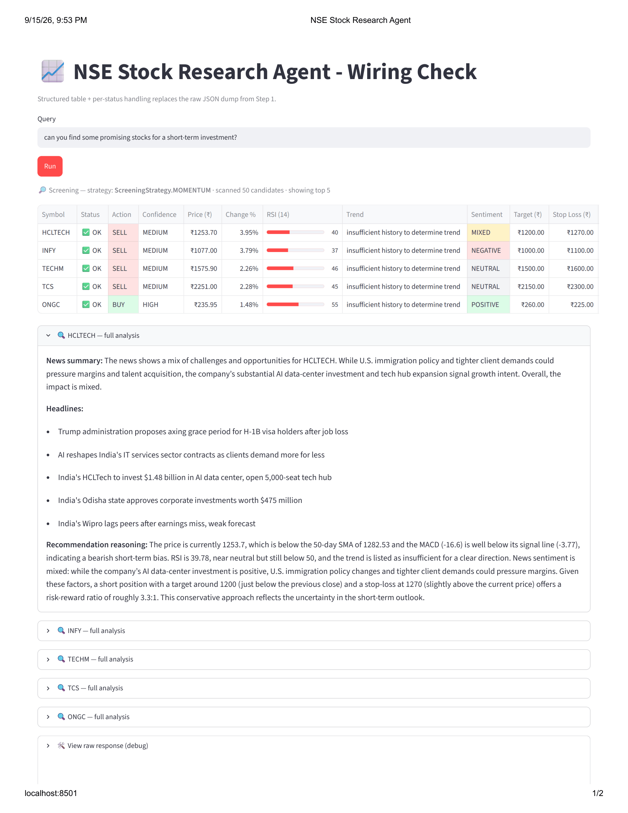

<div align="center">

# 📈 Stock Research Agent API

**Role-specific multi-agent NSE stock analysis — built on CrewAI + Groq, served over FastAPI.**

_Ask it a plain-English question. Get back a structured, validated, always-consistent JSON response — whether that's a BUY/SELL/HOLD call, a screened list of momentum picks, or an honest "I don't know" for anything off-topic._

[](https://www.python.org/)
[](https://fastapi.tiangolo.com/)
[](https://www.crewai.com/)
[](https://groq.com/)
[](https://github.com/astral-sh/uv)
[](https://docs.pytest.org/)
[](LICENSE)
[]()

</div>

---

<!--
  🎥 Demo goes here! Record a quick terminal walkthrough with
  https://asciinema.org or https://terminalizer.com hitting /analyze with a
  few different query types (single stock, screening, off-topic) and drop
  the embed/GIF here. A live example is worth more than another paragraph.
-->

## 📖 Table of Contents

- [Why this exists](#-why-this-exists)
- [Features](#-features)
- [Architecture](#-architecture)
- [Screening mode, in depth](#-screening-mode-in-depth)
- [Off-topic handling, in depth](#-off-topic-handling-in-depth)
- [Tech stack](#-tech-stack)
- [Quickstart](#-quickstart)
- [Usage](#-usage)
- [Configuration](#-configuration)
- [Project structure](#-project-structure)
- [Reliability design notes](#-reliability-design-notes)
- [Testing](#-testing)
- [Roadmap](#-roadmap)
- [Contributing](#-contributing)
- [License](#-license)

---

## 🎯 Why this exists

Most "AI stock analyst" demos are one flaky prompt away from a stack trace — tool calls that don't validate, JSON that doesn't parse, agents that hand off to the wrong place, or a chatbot that confidently answers questions it has no business answering. This project is a from-scratch rebuild focused on one goal: **an agentic system that behaves predictably, every time**, even on a free-tier LLM.

That means:

- 🧭 **Deterministic control flow.** Code decides _what happens_; agents only decide _content_. No agent decides which agent runs next.
- 🧱 **Structured I/O everywhere.** Every response has a fixed, validated JSON shape — never string-parsed free text.
- 🎯 **One narrow job per agent.** Each agent has at most one tool and a tightly scoped task, so there's minimal ambiguity about what it should do next.
- 🤷 **The API knows what it doesn't know.** Anything outside NSE stock research gets an honest "I can't help with that" from a path that never has a tool available to hallucinate in the first place.
- 🩹 **Graceful degradation.** One bad ticker, one flaky API call, or one malformed model response degrades that one part of the answer — it doesn't take down the whole request.

## ✨ Features

| | |
| --- | --- |
| 🗣️ **Natural language in** | `"should I buy TCS?"`, `"compare Infosys and Wipro"`, `"give me some momentum stocks"`, or even `"hi, how are you?"` — a dedicated intent classifier figures out what you actually want. |
| 🔎 **Screening mode** | No specific stock in mind? Ask for `"oversold IT stocks"` or `"top gainers today"` and the API scans a candidate universe, scores it deterministically, and runs full analysis on the winners. |
| 💬 **Honest off-topic handling** | Questions unrelated to NSE stocks (`"what's the weather?"`, `"how are you?"`) get answered by a direct LLM call with **zero tools attached** — it can chat, but it structurally _cannot_ call a tool or pretend to have real-time data it doesn't. |
| 🧑‍💼 **Three role-specific agents** | Market Data Analyst → News Sentiment Analyst → Recommendation Strategist, each with a narrow job and at most one tool. |
| 📊 **Free, keyless market data** | Price, volume, RSI-14, 50/200-day SMA, and MACD — computed by hand from `yfinance` history, fetched via a single-purpose `MarketDataTool`. |
| 📰 **Free news sentiment** | Headlines pulled from `yfinance` via `NewsTool`, classified by the News Sentiment Analyst — one data source covers both price and news. |
| 🧪 **Schema-validated everything** | Every agent output and the final API response are validated Pydantic models — no regex, no `.split(":")`. |
| 🔁 **Retries + backoff** | Every external call (Groq, yfinance) is wrapped with `tenacity` retry/backoff. |
| 📜 **Structured logging** | JSON logs split into `app.log` (HTTP layer) and `agent_trace.log` (every agent step / tool call / retry), correlated by request ID. |
| ⚡ **Runs on Groq's free tier** | Tuned for `openai/gpt-oss-120b` / `openai/gpt-oss-20b` and free-tier rate limits out of the box. |

## 🏗️ Architecture



### The crew, up close



| Agent | Tool | Job |
| --- | --- | --- |
| **Market Data Analyst** | `MarketDataTool` (`crewai.tools.BaseTool`) | Fetch price, volume, RSI-14, SMA-50/200, MACD for the symbol |
| **News Sentiment Analyst** | `NewsTool` (`crewai.tools.BaseTool`) | Fetch recent headlines and classify sentiment |
| **Recommendation Strategist** | _(none)_ | Synthesize the two prior outputs into a BUY/SELL/HOLD call — pure reasoning, no data access of its own |

Each tool-calling agent is deliberately limited to **exactly one tool**. Fewer tools per agent means less ambiguity about which one to invoke — which matters more than it sounds on smaller/free-tier models, where "pick the right tool" is itself a place things can go wrong.

> ⚠️ **Known gotcha with tool-tuned Groq models (e.g. `gpt-oss`):** if a tool-calling agent's task _also_ demands its final answer be reformatted into strict JSON matching a schema, the model can occasionally hallucinate a call to a nonexistent `"json"` tool instead of just answering — Groq correctly rejects this with `tool call validation failed ... not in request.tools`. If you hit that error, check whether the offending task is asking the same turn to both call a tool _and_ emit schema-perfect JSON; separating "call the tool" from "format the result" (or validating the tool's raw output directly rather than asking the model to re-emit it) avoids the issue. The Recommendation Strategist is unaffected since it has no tools to begin with.

## 🔎 Screening mode, in depth

When there's no specific stock in the query, the intent classifier extracts a **strategy** (and optional sector filter) instead of symbols:



| Strategy | What it looks for |
| --- | --- |
| `momentum` (default) | A blend of recent price gain and RSI strength — favors stocks rising without already being deeply overbought. |
| `top_gainers` | Ranked purely by recent % price change. |
| `oversold` | Lowest RSI-14 (below 35) — potential mean-reversion candidates. |
| `breakout` | Price recently crossed above its 50-day SMA — ranked by how far above. |

**No LLM ever picks the stocks.** Scoring is plain arithmetic on data the Market Data Analyst's tool already returns — deterministic, free, instant, and fully unit-testable without mocking a single network call. The LLM's job stays where it adds real value: interpreting news and writing the final recommendation for whichever candidates the scorer selects.

> ⚠️ The bundled candidate universe (`app/data/nifty50.json`) is a hand-curated sample, not a live index feed. Refresh it periodically against an authoritative source if you need it to track actual index membership.

## 💬 Off-topic handling, in depth

Every query gets classified into exactly one of two categories:

- **`stock_query`** — anything needing market data: a specific stock, a comparison, or a screening request.
- **`off_topic`** — everything else, from genuine small talk (`"how are you?"`) to fully unrelated questions (`"what's the weather in Mumbai?"`).

`off_topic` queries never touch the CrewAI crew at all — they're answered by a **direct** Groq call with no tools passed in the request. That's not a prompt instruction asking the model to behave; it's a structural guarantee. A model literally cannot attempt a tool call if the API request never offered it any tools to call, which is why this path (unlike the crew above) can make that "structurally impossible" claim.

The system prompt (see `app/prompts/conversational.py`) is deliberately blunt about this:

> _"Answer with only your trained knowledge. Do not use any tools. Do not make up any data. If the user asks for something you don't know, say so."_

If the Groq call itself fails (rate limit, outage), the fallback is just as honest — a static "I can't answer that, I'm only trained on stock market data" — never a crash, and never a guess.

## 🧰 Tech stack

| Layer | Choice |
| --- | --- |
| API framework | [FastAPI](https://fastapi.tiangolo.com/) |
| Agent orchestration | [CrewAI](https://www.crewai.com/) (`Process.sequential`) |
| LLM provider | [Groq](https://groq.com/) (`openai/gpt-oss-120b`, `openai/gpt-oss-20b`) |
| Market & news data | [yfinance](https://github.com/ranaroussi/yfinance) (free, no API key) |
| Validation | [Pydantic v2](https://docs.pydantic.dev/) |
| Logging | [structlog](https://www.structlog.org/) |
| Retries | [tenacity](https://github.com/jd/tenacity) |
| Package management | [uv](https://github.com/astral-sh/uv) |
| Testing | [pytest](https://docs.pytest.org/) |

## 🚀 Quickstart

```bash
git clone https://github.com/rooneyrulz/stock-research-agent-api.git
cd stock-research-agent-api

cp .env.example .env
# edit .env and set GROQ_API_KEY — free key: https://console.groq.com/keys

uv sync
uv run uvicorn app.main:app --reload
```

- 🌐 API base: `http://localhost:8000`
- 📚 Interactive docs: `http://localhost:8000/docs`
- ❤️ Health check: `GET /health`

## 💻 Usage

<table>
<tr>
<td>

**Single stock**

```bash
curl -X POST http://localhost:8000/analyze \
  -H "Content-Type: application/json" \
  -d '{"query": "should I buy TCS right now?"}'
```

</td>
<td>

**Comparison**

```bash
curl -X POST http://localhost:8000/analyze \
  -H "Content-Type: application/json" \
  -d '{"query": "compare Infosys and Wipro"}'
```

</td>
</tr>
<tr>
<td>

**Screening**

```bash
curl -X POST http://localhost:8000/analyze \
  -H "Content-Type: application/json" \
  -d '{"query": "give me some oversold banking stocks"}'
```

</td>
<td>

**Off-topic**

```bash
curl -X POST http://localhost:8000/analyze \
  -H "Content-Type: application/json" \
  -d '{"query": "what is the weather like today?"}'
```

</td>
</tr>
</table>

<details>
<summary>📦 Example: stock analysis response (click to expand)</summary>

```json
{
  "status": "completed",
  "request_id": "f873d56f-ac6d-45c1-bab1-2636abd0cc84",
  "timestamp": "2026-08-27T09:00:46.328710Z",
  "query": "should I buy TCS right now?",
  "needs_clarification": false,
  "clarification_message": null,
  "results": [
    {
      "symbol": "TCS",
      "market_data": {
        "symbol": "TCS",
        "current_price": 3500.0,
        "previous_close": 3480.0,
        "change_pct": 0.57,
        "volume": 1000000,
        "rsi_14": 58.2,
        "sma_50": 3410.5,
        "sma_200": 3220.8,
        "macd": 12.4,
        "macd_signal": 9.1,
        "trend": "uptrend: price above both 50 and 200-day moving averages"
      },
      "news_sentiment": {
        "symbol": "TCS",
        "sentiment": "MIXED",
        "headline_count": 5,
        "key_headlines": ["Porsche sells MHP consulting unit to TCS in $1.5 billion AI deal"],
        "summary": "A major acquisition is a positive catalyst, offset by sector-wide AI margin pressure concerns."
      },
      "recommendation": {
        "symbol": "TCS",
        "action": "HOLD",
        "confidence": "MEDIUM",
        "target_price": 3650.0,
        "stop_loss": 3350.0,
        "risk_reward_ratio": "1:1.5",
        "reasoning": "Uptrend intact and the MHP acquisition is a positive catalyst, but sector-wide AI margin concerns warrant caution before adding."
      },
      "error": null
    }
  ],
  "screening_meta": null,
  "summary": "TCS: HOLD (MEDIUM confidence). Target: 3650.0, Stop-loss: 3350.0. Uptrend intact...",
  "warnings": []
}
```

</details>

<details>
<summary>📦 Example: screening response (click to expand)</summary>

```json
{
  "status": "completed",
  "request_id": "a1b2c3d4-...",
  "timestamp": "2026-09-11T10:15:00.000000Z",
  "query": "give me some oversold banking stocks",
  "needs_clarification": false,
  "results": [
    { "symbol": "SBIN", "market_data": { "...": "..." }, "recommendation": { "...": "..." } }
  ],
  "screening_meta": {
    "strategy_used": "oversold",
    "sector_filter": "banking",
    "universe_scanned": 8,
    "candidates_returned": 1
  },
  "summary": "SBIN: HOLD (MEDIUM confidence). ...",
  "warnings": []
}
```

</details>

<details>
<summary>📦 Example: off-topic response (click to expand)</summary>

```json
{
  "status": "off_topic",
  "request_id": "e5f6a7b8-...",
  "timestamp": "2026-09-11T10:20:00.000000Z",
  "query": "what is the weather like today?",
  "needs_clarification": false,
  "results": [],
  "screening_meta": null,
  "summary": "I can't answer that, I'm only trained on stock market data.",
  "warnings": []
}
```

</details>

Every response — regardless of what was asked — has this same fixed shape. A stock query with no identifiable symbol or screening strategy returns `"status": "clarification_needed"` instead of guessing; a screening query that matches nothing returns the same, with `screening_meta` explaining what was scanned.

## ⚙️ Configuration

All settings live in `app/config.py` and are overridable via `.env`:

| Variable | Default | Description |
| --- | --- | --- |
| `GROQ_API_KEY` | _(required)_ | Free key from [console.groq.com](https://console.groq.com/keys) |
| `GROQ_TOOL_MODEL` | `openai/gpt-oss-120b` | Model used by the two tool-calling agents (Market Data Analyst, News Sentiment Analyst) |
| `GROQ_REASONING_MODEL` | `openai/gpt-oss-20b` | Model used by the Recommendation Strategist, the intent classifier, and off-topic replies |
| `GROQ_MAX_REQUESTS_PER_MINUTE` | `20` | Keeps requests under Groq's free-tier RPM |
| `MAX_SYMBOLS_PER_REQUEST` | `3` | Cap on comparison-mode requests |
| `MARKET_DATA_PERIOD` | `6mo` | yfinance history window for indicators |
| `MAX_SCREENING_RESULTS` | `5` | How many top-ranked candidates flow into the crew |
| `SCREENING_UNIVERSE_PATH` | `app/data/nifty50.json` | Bundled candidate symbol list |
| `SCREENING_SCAN_PERIOD` | `1mo` | Cheaper yfinance history window used only for the ranking scan |
| `SCREENING_MAX_WORKERS` | `10` | Threadpool size for concurrent candidate scanning |
| `ENVIRONMENT` | `development` | `verbose=True` on agents/crew when set to `development` |
| `LOG_LEVEL` | `INFO` | Standard Python log levels |

## 📂 Project structure

```
app/
├── config.py                    # All settings (env-driven)
├── logging_config.py            # structlog setup → app.log + agent_trace.log
├── schemas.py                   # Every Pydantic model — the system's data contract
├── intent.py                    # Free-text query → structured UserIntent (category, mode, symbols, screening_criteria)
├── conversational.py            # Off-topic answering: direct Groq call, zero tools attached
├── screening.py                 # Deterministic candidate scoring + concurrent yfinance scan
├── pipeline.py                  # Orchestration: intent → (off_topic reply | crew | screen → crew) → response
├── prompts/
│   ├── intent.py                 # SYSTEM_PROMPT for the intent classifier
│   └── conversational.py         # SYSTEM_PROMPT for off-topic answering
├── data/
│   └── nifty50.json              # Bundled screening candidate universe
├── tools/
│   └── yfinance_tools.py         # MarketDataTool + NewsTool (crewai.tools.BaseTool), with retries
├── agents/
│   ├── llm_config.py             # Groq ↔ CrewAI LLM wiring
│   └── crew_factory.py           # The 3-agent crew: Market Data Analyst → News Sentiment Analyst → Recommendation Strategist
└── main.py                       # FastAPI app: POST /analyze, GET /health
tests/
├── test_smoke.py
├── test_screening.py
└── test_conversational.py
```

> 📝 Prompts live in their own `app/prompts/` package, separate from the logic that calls them. Editing a system prompt (tone, examples, new classification rules) never means touching orchestration code, and vice versa.

## 🛡️ Reliability design notes

<details>
<summary><strong>Click to expand — specific failure modes this design targets</strong></summary>

| Failure mode | Root cause elsewhere | How it's addressed here |
| --- | --- | --- |
| Tool call errors | Weak tool-calling model, agents juggling multiple tools | Each tool-calling agent is limited to exactly one narrowly-scoped tool (`MarketDataTool` / `NewsTool`) |
| Hallucinated tool calls on off-topic/chit-chat | Model tries to "help" by calling a tool anyway | Off-topic requests to Groq include **no tools parameter at all** — a tool call is structurally impossible on that path |
| Phantom `"json"` tool calls from tool-having agents | Tool-tuned Groq models occasionally hallucinate a function call when also told to emit strict JSON | Known gotcha, documented above — keep tool-calling and JSON-reformatting out of the same task where possible |
| Schema/validation errors | No input/output schemas | Pydantic models on every boundary, with retries on parse failure |
| Parsing errors | Manual string-splitting on free text | JSON-schema-guided prompts + our own `json.loads` + `model_validate` |
| Routing / handoff loops | LLM-driven supervisor decides "who's next" | `Process.sequential` — code decides the order, always |
| Unreliable stock picking | Asking an LLM to "choose good stocks" from a list | Screening uses a pure, deterministic scoring function — no LLM involved in ranking |
| Cascading failures | One bad symbol/tool kills the whole request | Per-symbol try/except; news and individual screening-candidate failures degrade gracefully instead of failing the request |
| Provider URL bugs | Base URL conventions differ between SDKs | Documented explicitly in `llm_config.py` / `intent.py` (Groq SDK vs. OpenAI-compatible client) |

</details>

## 💻 Streamlit UI

```bash
uv run streamlit run streamlit_app/main.py
```



## 🧪 Testing

```bash
uv run pytest -q
```

Covers pure logic offline — symbol normalization, indicator math (including edge cases like all-gain/all-loss RSI windows), screening score functions per strategy, candidate-universe loading, and schema validation. Off-topic and intent-classification tests mock the Groq call boundary directly, so the suite runs without hitting the network or burning API quota. Live Groq/yfinance calls, and the crew's actual multi-agent tool-calling behavior, aren't exercised in CI yet — that's what the Phase 3 golden-set regression suite is for (see [Roadmap](#-roadmap)).

## 🗺️ Roadmap

- [x] **Phase 1** — Sequential 3-agent crew, structured I/O, free data sources, structured logging
- [x] **Phase 2** — Screening/stock-finder mode, LLM-based off-topic handling with zero tool exposure
- [ ] **Phase 2.5** — Redis caching, async job queue for long/screening requests
- [ ] **Phase 3** — Full observability (token/cost/latency dashboards), hierarchical multi-turn conversations, golden-set regression CI covering live tool-calling behavior

## 🤝 Contributing

We welcome contributions! Please see our contributing guidelines:

1. Fork the repository
2. Create a feature branch (`git checkout -b feature/amazing-feature`)
3. Commit your changes (`git commit -m 'Add some amazing feature'`)
4. Push to the branch (`git push origin feature/amazing-feature`)
5. Open a Pull Request

Issues and PRs welcome. If you hit a new failure mode against Groq or another provider, please include the raw error payload — that's exactly how the last few reliability fixes here got made.

## 📄 License

This project is licensed under the MIT License - see the [LICENSE](LICENSE) file for details.

## 🆘 Support

For support and questions:

- Open an issue on GitHub
- Check the documentation
- Review the troubleshooting guide

---

**Made with ❤️ for the Indian Stock Market Community**
