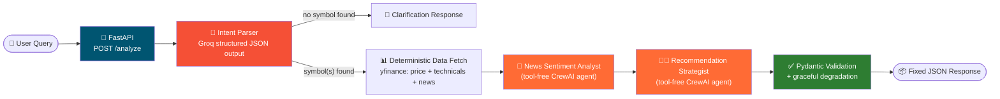

<div align="center">

# 📈 Stock Research Agent API

**Role-specific multi-agent NSE stock analysis — built on CrewAI + Groq, served over FastAPI.**

_Ask it a plain-English question. Get back a structured, validated, always-consistent JSON recommendation._

[](https://www.python.org/)
[](https://fastapi.tiangolo.com/)
[](https://www.crewai.com/)
[](https://groq.com/)
[](https://github.com/astral-sh/uv)
[](https://docs.pytest.org/)
[](LICENSE)
[]()

</div>

---

## 📖 Table of Contents

- [Why this exists](#-why-this-exists)
- [Features](#-features)
- [Architecture](#-architecture)
- [Tech stack](#-tech-stack)
- [Quickstart](#-quickstart)
- [Usage](#-usage)
- [Configuration](#-configuration)
- [Project structure](#-project-structure)
- [Reliability design notes](#-reliability-design-notes)
- [Testing](#-testing)
- [Roadmap](#-roadmap)
- [Contributing](#-contributing)
- [License](#-license)

---

## 🎯 Why this exists

Most "AI stock analyst" demos are one flaky prompt away from a stack trace — tool calls that don't validate, JSON that doesn't parse, agents that hand off to the wrong place. This project is a from-scratch rebuild focused on one goal: **an agentic system that behaves predictably, every time**, even on a free-tier LLM.

That means:

- 🧭 **Deterministic control flow.** Code decides _what happens_; agents only decide _content_. No agent decides which agent runs next.
- 🧱 **Structured I/O everywhere.** Every response has a fixed, validated JSON shape — never string-parsed free text.
- 🛠️ **Tools kept out of the reasoning loop where they don't need to be.** Data fetching is deterministic Python; LLM agents are reserved for judgment calls (sentiment, recommendation synthesis).
- 🩹 **Graceful degradation.** One bad ticker, one flaky API call, or one malformed model response degrades that one part of the answer — it doesn't take down the whole request.

## ✨ Features

|                                    |                                                                                                                                                           |
| ---------------------------------- | --------------------------------------------------------------------------------------------------------------------------------------------------------- |
| 🗣️ **Natural language in**         | `"should I buy TCS?"`, `"compare Infosys and Wipro for a swing trade"` — a dedicated intent-parsing step figures out the symbols, mode, and time horizon. |
| 🧑‍💼 **Role-specific agents**        | A News Sentiment Analyst and a Trading Recommendation Strategist, each with a narrow, well-defined job.                                                   |
| 📊 **Free, keyless market data**   | Price, volume, RSI-14, 50/200-day SMA, and MACD — computed by hand from `yfinance` history, no paid API required.                                         |
| 📰 **Free news sentiment**         | Headlines pulled from `yfinance`, classified by an LLM agent — one data source covers both price and news.                                                |
| 🧪 **Schema-validated everything** | Every agent output and the final API response are validated Pydantic models — no regex, no `.split(":")`.                                                 |
| 🔁 **Retries + backoff**           | Every external call (Groq, yfinance) is wrapped with `tenacity` retry/backoff.                                                                            |
| 📜 **Structured logging**          | JSON logs split into `app.log` (HTTP layer) and `agent_trace.log` (every agent step / tool call / retry), correlated by request ID.                       |
| ⚡ **Runs on Groq's free tier**    | Tuned for `openai/gpt-oss-120b` / `openai/gpt-oss-20b` and free-tier rate limits out of the box.                                                          |

## 🏗️ Architecture



**Why two agents instead of three-plus-tools?** Earlier iterations gave agents both tools _and_ a JSON-output instruction, which caused Groq's tool-tuned OSS models to occasionally hallucinate a call to a nonexistent `"json"` tool. Since price/news lookups need no LLM judgment, they moved to plain deterministic Python — leaving agents free of tools entirely, so a phantom tool call is structurally impossible. Judgment (sentiment, recommendation) stays with the LLM, where it belongs.

## 🧰 Tech stack

| Layer               | Choice                                                                  |
| ------------------- | ----------------------------------------------------------------------- |
| API framework       | [FastAPI](https://fastapi.tiangolo.com/)                                |
| Agent orchestration | [CrewAI](https://www.crewai.com/) (`Process.sequential`)                |
| LLM provider        | [Groq](https://groq.com/) (`openai/gpt-oss-120b`, `openai/gpt-oss-20b`) |
| Market & news data  | [yfinance](https://github.com/ranaroussi/yfinance) (free, no API key)   |
| Validation          | [Pydantic v2](https://docs.pydantic.dev/)                               |
| Logging             | [structlog](https://www.structlog.org/)                                 |
| Retries             | [tenacity](https://github.com/jd/tenacity)                              |
| Package management  | [uv](https://github.com/astral-sh/uv)                                   |
| Testing             | [pytest](https://docs.pytest.org/)                                      |

## 🚀 Quickstart

```bash
git clone https://github.com/rooneyrulz/stock-research-agent-api.git
cd stock-research-agent-api

cp .env.example .env
# edit .env and set GROQ_API_KEY — free key: https://console.groq.com/keys

uv sync
uv run uvicorn app.main:app --reload
```

- 🌐 API base: `http://localhost:8000`
- 📚 Interactive docs: `http://localhost:8000/docs`
- ❤️ Health check: `GET /health`

## 💻 Usage

<table>
<tr>
<td>

**Single stock**

```bash
curl -X POST http://localhost:8000/analyze \
  -H "Content-Type: application/json" \
  -d '{"query": "should I buy TCS right now?"}'
```

</td>
<td>

**Comparison**

```bash
curl -X POST http://localhost:8000/analyze \
  -H "Content-Type: application/json" \
  -d '{"query": "compare Infosys and Wipro for a short term trade"}'
```

</td>
</tr>
</table>

<details>
<summary>📦 Example response (click to expand)</summary>

```json
{
    "status": "completed",
    "request_id": "f873d56f-ac6d-45c1-bab1-2636abd0cc84",
    "timestamp": "2026-08-27T09:00:46.328710Z",
    "query": "should I buy TCS right now?",
    "needs_clarification": false,
    "clarification_message": null,
    "results": [
        {
            "symbol": "TCS",
            "market_data": {
                "symbol": "TCS",
                "current_price": 3500.0,
                "previous_close": 3480.0,
                "change_pct": 0.57,
                "volume": 1000000,
                "rsi_14": 58.2,
                "sma_50": 3410.5,
                "sma_200": 3220.8,
                "macd": 12.4,
                "macd_signal": 9.1,
                "trend": "uptrend: price above both 50 and 200-day moving averages"
            },
            "news_sentiment": {
                "symbol": "TCS",
                "sentiment": "MIXED",
                "headline_count": 5,
                "key_headlines": [
                    "Porsche sells MHP consulting unit to TCS in $1.5 billion AI deal"
                ],
                "summary": "A major acquisition is a positive catalyst, offset by sector-wide AI margin pressure concerns."
            },
            "recommendation": {
                "symbol": "TCS",
                "action": "HOLD",
                "confidence": "MEDIUM",
                "target_price": 3650.0,
                "stop_loss": 3350.0,
                "risk_reward_ratio": "1:1.5",
                "reasoning": "Uptrend intact and the MHP acquisition is a positive catalyst, but sector-wide AI margin concerns warrant caution before adding."
            },
            "error": null
        }
    ],
    "summary": "TCS: HOLD (MEDIUM confidence). Target: 3650.0, Stop-loss: 3350.0. Uptrend intact...",
    "warnings": []
}
```

</details>

Every response — regardless of what was asked — has this same fixed shape. A query with no identifiable stock symbol returns `"status": "clarification_needed"` instead of guessing.

## ⚙️ Configuration

All settings live in `app/config.py` and are overridable via `.env`:

| Variable                       | Default               | Description                                                     |
| ------------------------------ | --------------------- | --------------------------------------------------------------- |
| `GROQ_API_KEY`                 | _(required)_          | Free key from [console.groq.com](https://console.groq.com/keys) |
| `GROQ_TOOL_MODEL`              | `openai/gpt-oss-120b` | _(reserved for future tool-calling agents)_                     |
| `GROQ_REASONING_MODEL`         | `openai/gpt-oss-20b`  | Model used by both current agents                               |
| `GROQ_MAX_REQUESTS_PER_MINUTE` | `20`                  | Keeps requests under Groq's free-tier RPM                       |
| `MAX_SYMBOLS_PER_REQUEST`      | `3`                   | Cap on comparison-mode requests                                 |
| `MARKET_DATA_PERIOD`           | `6mo`                 | yfinance history window for indicators                          |
| `ENVIRONMENT`                  | `development`         | `verbose=True` on agents/crew when set to `development`         |
| `LOG_LEVEL`                    | `INFO`                | Standard Python log levels                                      |

## 📂 Project structure

```
app/
├── config.py              # All settings (env-driven)
├── logging_config.py      # structlog setup → app.log + agent_trace.log
├── schemas.py              # Every Pydantic model — the system's data contract
├── intent.py                 # Free-text query → structured UserIntent
├── pipeline.py                 # Deterministic orchestration: intent → fetch → crew → response
├── tools/
│   └── yfinance_tools.py         # Free market data + news fetchers, with retries
├── agents/
│   ├── llm_config.py               # Groq ↔ CrewAI LLM wiring
│   └── crew_factory.py               # The 2-agent tool-free crew
└── main.py                             # FastAPI app: POST /analyze, GET /health
tests/
└── test_smoke.py
```

## 🛡️ Reliability design notes

<details>
<summary><strong>Click to expand — specific failure modes this design avoids</strong></summary>

| Failure mode             | Root cause elsewhere                        | How it's avoided here                                                                          |
| ------------------------ | ------------------------------------------- | ---------------------------------------------------------------------------------------------- |
| Tool call errors         | Weak tool-calling model, ambiguous tools    | Deterministic Python for data fetching; zero tools on any LLM agent                            |
| Schema/validation errors | No input/output schemas                     | Pydantic models on every boundary, with retries on parse failure                               |
| Parsing errors           | Manual string-splitting on free text        | JSON-schema-guided prompts + our own `json.loads` + `model_validate`                           |
| Routing / handoff loops  | LLM-driven supervisor decides "who's next"  | `Process.sequential` — code decides the order, always                                          |
| Cascading failures       | One bad symbol/tool kills the whole request | Per-symbol try/except; news failures degrade gracefully instead of failing the request         |
| Provider URL bugs        | Base URL conventions differ between SDKs    | Documented explicitly in `llm_config.py` / `intent.py` (Groq SDK vs. OpenAI-compatible client) |

</details>

## 🧪 Testing

```bash
uv run pytest -q
```

Covers pure logic offline — symbol normalization, indicator math (including edge cases like all-gain/all-loss RSI windows), and schema validation. Live Groq/yfinance calls aren't exercised in CI yet; that's what the Phase 2 golden-set regression suite is for (see [Roadmap](#-roadmap)).

## 🗺️ Roadmap

- [x] **Phase 1** — Deterministic sequential pipeline, structured I/O, free data sources, structured logging
- [ ] **Phase 2** — Screener/stock-finder mode, Redis caching, async job queue for long requests
- [ ] **Phase 3** — Full observability (token/cost/latency dashboards), hierarchical multi-turn conversations, golden-set regression CI

## 🤝 Contributing

Issues and PRs welcome. If you hit a new failure mode against Groq or another provider, please include the raw error payload — that's exactly how the last few reliability fixes here got made.

## 📄 License

[MIT](LICENSE)
